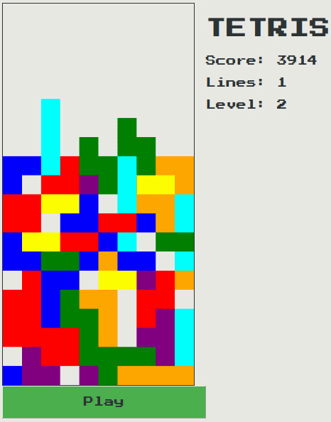

# TETRJS

A Tetris game developed using Javascript. Available at [https://beatorizu.github.io/TETRJS/](https://beatorizu.github.io/TETRJS/)

## TETRJS in action

## References
[Learning Modern JavaScript with Tetris by Michael Karén](https://medium.com/@michael.karen/learning-modern-javascript-with-tetris-92d532bcd057)
